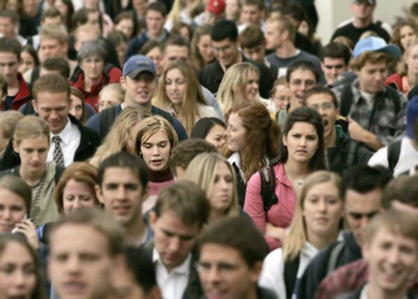
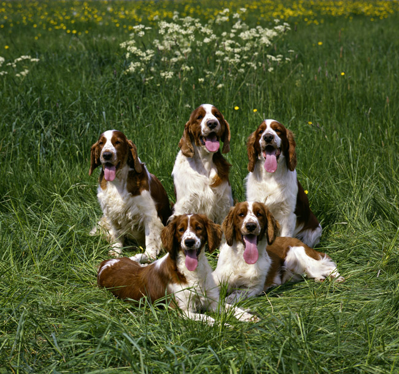
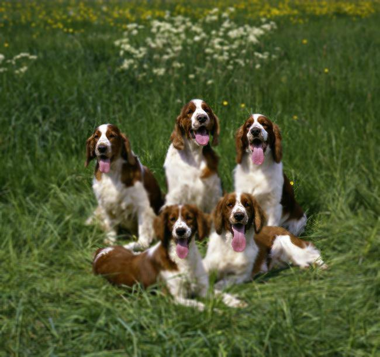

# Focal
Automatic Background Blurring using DNN Saliency Maps

# Introduction
This project uses a pre-trained image recognition model from the
incredibly popular [ImageNet](http://www.image-net.org/) dataset.
Namely, this project uses the pre-trained variant of
[AlexNet](https://papers.nips.cc/paper/4824-imagenet-classification-with-deep-convolutional-neural-networks.pdf)
provided by the popular Deep Learning Python framework, [PyTorch](https://pytorch.org/).

Using Alexnet, the primary class of the input image is found by using the network for inference.
The Saliency map of the image is then computed. Saliency maps were originally proposed in a 
[2014 paper by Simonyan et al.](https://arxiv.org/abs/1312.6034)
to visualize the spatial support of a image's class (i.e.: Dog, Cat, Coffee Mug) with the
pixels of the image itself. We use a slightly modified version of these maps with
Guided Backpropagation to produce a less noisy map, and subsequently a better focus on the
"foreground" of the image.

The map is then slightly blurred, and used to mask the original image with a blurred
image of itself. This produces a natural-looking background blur that looks like you
did it in-camera. Like so:

A woman in a crowd

A group of dogs (Welsh Springer Spaniels, specifically)

# Setup

## With Docker
TODO

## Without Docker
Install the requirements with Pip

    pip3 install -r requirements.txt

This project is intended to be used with Docker, but you can use it locally
by running `python3 app.py`. **Make sure to change the port number in the last
line of `app.py`**.

# Using the endpoint
This project is set up to be used as a REST endpoint, which returns a JSON object
containing images in Base64. Images are also sent to the endpoint using JSON with
Base64. You should structure the body of your POST request to the root endpoint `/`
like so:

    {'img': <base64 string of image> }

## Response
The response will be formatted like so:

    {
        'class':            str(cls),
        'probability':      float(conf),
        'blurredImage':     str(encoded_img),
        'maskImage':        str(encoded_img_mask),
        'unblurredMask':    str(encoded_img_saliency)
    }
    
In descending order:

* The top ImageNet class of the given input image as determined by the pre-trained
AlexNet model from PyTorch.

* The probability that the given input image is that class from above.

* The automatically blurred image using the saliency map generated 
using the input image, and inferred class.

* The blurred version of the mask below.

* The black and white saliency map of the image. This is done by adding the positive
saliency map to the negative saliency map, and converting to greyscale. More info
can be found in the paper in `doc/`. 

## Testing

An example of how to interface with the endpoint can be found in `client.py`

# Acknowledgment
Special thank you to Utku Ozbulak for offering his repository,
[pytorch-cnn-visualizations](https://github.com/utkuozbulak/pytorch-cnn-visualizations)
under the MIT license. His contributions to this repository saved
a great amount of time in implementing the visualization procedures
of this project.
